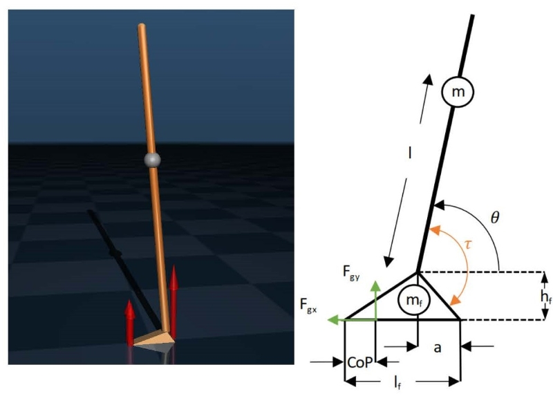

# MuJoCo Human Standing Balance Simulation - Ozay Lab @ University of Michigan

This repository provides platform for simulating human standing balance models in MuJoCo, ranging from simple two-link inverted pendulum models to advanced multi-joint models with exoskeleton assistance. The models allow for studying stabilizable regions of state space and optimizing control strategies for human-exoskeleton systems.

 \
**Figure 1.** MuJoCo Two-link Standing Balance Model (left) w/ contact forces shown in red; Theoretical Two-link Model (right).

## Libraries to Install

## Repository Structure

This repository is organized into several key directories:

- **joint1_humanoid**: Advanced single-joint (ankle) model with exoskeleton assistance and optimal control implementations
- **joint2_humanoid**: Two-joint (ankle-hip) model with enhanced controller architecture 
- Legacy models (initial_humanoid, final_humanoid, muscle_humanoid): Earlier iterations of the models with basic control strategies

Each directory contains:
- XML model files
- `config.yaml` for simulation parameters
- Controller implementations
- Visualization and data handling utilities
- (For joint1_humanoid) MATLAB optimization scripts

## How to use the Configuration file

## Simulation Models

### joint1_humanoid: Ankle Exoskeleton Model

The `joint1_humanoid` directory contains an advanced ankle balance model with exoskeleton assistance capabilities. It features:

#### Key Features
- **Human-exoskeleton coordination**: Integrated control strategies for human and exoskeleton
- **MATLAB optimal control**: Pre-computed optimal trajectories using direct collocation
- **Dynamic gain calculation**: Biomechanically-informed gain scheduling
- **System dynamics modification**: Accounts for exoskeleton's effect on plant dynamics
- **Multiple controller types**:
  - Human: LQR, PD, and pre-computed trajectory controllers
  - Exoskeleton: PD controllers with various assistance strategies

#### Running the joint1_humanoid Simulation
1. Navigate to the directory: `cd joint1_humanoid` 
2. Run the simulation: `python simulation.py`
3. Results will be saved in a timestamped folder in the `data` directory

#### Experimental Scenarios
The model has been tested in four key scenarios:
1. **Both Balance**: Human and exoskeleton controllers successfully balance together
2. **Both Unbalance**: Neither controller alone can stabilize
3. **Exo Improves**: Exoskeleton assists an otherwise unstable human controller
4. **Exo Breaks**: Poorly tuned exoskeleton destabilizes an otherwise stable human controller

### joint2_humanoid: Ankle-Hip Model

The `joint2_humanoid` directory contains a more complex two-joint model with both ankle and hip control.

#### Key Features
- **Multi-joint control**: Coordinated ankle and hip joint dynamics
- **Enhanced anthropometrics**: More accurate mass and geometry distribution
- **Improved visualization**: Better rendering of forces and biomechanical properties
- **Advanced controllers**:
  - Ankle: Human and exoskeleton controllers (similar to joint1_humanoid)
  - Hip: PD controller with biomechanically realistic constraints
- **Rate-of-torque-development (RTD) limits**: Physiologically accurate torque application limits

#### Running the joint2_humanoid Simulation
1. Navigate to the directory: `cd joint2_humanoid` 
2. Run the simulation: `python simulation.py`
3. Results include both ankle and hip joint data

### Legacy Models

The repository also includes several earlier model iterations that may be useful for specific studies:

- **initial_humanoid**: First revision with simplified dynamics
- **final_humanoid**: Refined model with corrected reference frames
- **muscle_humanoid**: Model using MuJoCo's muscle and tendon elements for more biologically accurate actuation

These models are maintained for reference but are less advanced than the joint1_humanoid and joint2_humanoid implementations.

## MuJoCo Simulation Class Architecture

### Controller Methods

Each simulation uses a modular controller architecture:

- **Human controllers**: Model human motor control strategies
  - `HumanLQRController`: Uses optimal control theory to generate stabilizing torques
  - `HumanPDController`: Simple proportional-derivative controller
  - `HumanPrecomputedController`: Applies pre-calculated optimal trajectories

- **Exoskeleton controllers**: Model assistive devices
  - `ExoPDController`: Provides assistance based on joint angle and velocity
  - `ExoNoneController`: Simulates disabled exoskeleton (zero torque)

- **Hip controllers** (joint2_humanoid only):
  - `HipPDController`: Controls the hip joint with physiological constraints
  - `HipNoneController`: Disables hip control for ankle-only studies

Controllers can be toggled in the `config.yaml` file by setting appropriate controller types and parameters.

### Run Method

The simulation's main execution method handles:

1. Loading configuration parameters
2. Setting up the physics model and renderer
3. Initializing controllers and data handlers
4. Running the simulation loop with perturbations and data collection
5. Saving results and generating visualizations

## Experiments Results
https://www.notion.so/MuJoCo-Simulation-1df7d0facf8a800cabb1cf42b29149c1
https://docs.google.com/presentation/d/1VR8CqYIliBoyK5xkXzbccSOwzxNYH7VUIWC2zvRn12Y/edit?slide=id.p1#slide=id.p1

