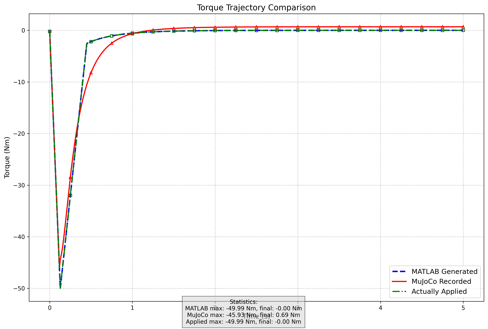

# Enhanced Ankle Exoskeleton Control System

## 1. Exoskeleton PD Controller Enhancements

### Dynamic Gain Calculation

The exoskeleton PD controller has been significantly improved by implementing dynamic gain calculation based on biomechanical principles from the academic literature. Instead of using static PD gains, the controller now calculates appropriate gains based on the user's anthropometric data:

```python
# Calculate dynamic gains
kp = K_p  # Already calculated as m_body * g * l_COM
kd = 0.3 * np.sqrt(m_body * l_COM**2 * kp)
```

This approach ensures the controller is properly tuned to each user's specific body parameters rather than using one-size-fits-all values.

### Integration with Human LQR Controller

The exoskeleton controller is now better integrated with the human controller, allowing for more natural coordination between human and exoskeleton torques:

```python
# For LQR, also pass exo configuration if exo is enabled
if exo_type != "None":
    human_params['exo_config'] = exo_config
    
    # Get the pre-calculated values from xml_utilities for dynamic gains
    if exo_type == "PD" and exo_config.get('pd_params', {}).get('use_dynamic_gains', False):
        # Pass dynamic gains to LQR controller
        human_params['dynamic_gains'] = {
            'kp': kp,
            'kd': kd
        }
```

### Modified System Dynamics

The human LQR controller now accounts for the exoskeleton's effect on system dynamics by modifying the system matrices:

```python
# Modify system matrices to account for exoskeleton PD control
# The exo PD controller effectively changes the system dynamics:
# 1. Adds damping (b + Kd)
# 2. Changes effective stiffness (mgl - Kp)
A_exo = np.array([
    [0, 1],
    [(self.m*self.g*self.l - exo_kp)/self.I, -(self.b + exo_kd)/self.I]
])
```

This approach ensures that the human controller properly compensates for the exoskeleton's behavior, rather than fighting against it.

### Gear Ratio Scaling

The controller now properly scales gains by the exoskeleton gear ratio to match the control space:

```python
# Scale gains by the exoskeleton gear ratio to match the control space
exo_actuator_id = mj.mj_name2id(self.model, mj.mjtObj.mjOBJ_ACTUATOR, "exo_ankle_actuator")
if exo_actuator_id >= 0:
    exo_gear_ratio = self.model.actuator_gear[exo_actuator_id][0]
    exo_kp = exo_kp / exo_gear_ratio  # Scale to control space
    exo_kd = exo_kd / exo_gear_ratio  # Scale to control space
```

## 2. Modified Human LQR Controller for Exoskeleton Interaction

### Mathematical Derivation

The human LQR controller has been enhanced to account for the presence of the exoskeleton. This adaptation is critical because the exoskeleton alters the dynamics of the combined human-exoskeleton system.

#### State Equation for Human-Only System

For the human-only system, the state-space representation follows a standard inverted pendulum model:

```
ẋ = Ax + Bu
```

where:
- `x = [θ, θ̇]ᵀ` is the state vector (ankle angle and velocity)
- `A = [0, 1; mgl/I, -b/I]` is the system matrix
- `B = [0; 1/I]` is the input matrix
- `u` is the control input (human ankle torque)
- `m` is body mass, `g` is gravity, `l` is distance to COM, `I` is moment of inertia, and `b` is joint damping

The dynamics are defined by:
```python
A = np.array([[0, 1],
             [self.m*self.g*self.l/self.I, -self.b/self.I]])
B = np.array([[0],
             [1/self.I]])
```

#### Modified State Equation with Exoskeleton

When the exoskeleton is active, its PD controller applies torque based on:

```
τ_exo = -Kp·θ - Kd·θ̇
```

This exoskeleton torque changes the effective dynamics of the system. The new state equation becomes:

```
ẋ = A_exo x + Bu
```

where:
```
A_exo = [0, 1; (mgl-Kp)/I, -(b+Kd)/I]
```

The implementation reflects this adjusted dynamics:

```python
A_exo = np.array([
    [0, 1],
    [(self.m*self.g*self.l - exo_kp)/self.I, -(self.b + exo_kd)/self.I]
])

B_exo = np.array([
    [0],
    [1/self.I]
])
```

#### Control Law

The LQR control law for both cases is:

```
u = -Kx
```

where K is the optimal gain matrix solving the algebraic Riccati equation.

For the human-only system:
```python
P = linalg.solve_continuous_are(A, B, self.Q, self.R)
K = np.linalg.solve(self.R, B.T @ P)
```

For the human-exoskeleton system:
```python
P_exo = linalg.solve_continuous_are(A_exo, B_exo, self.Q, self.R)
K_exo = np.linalg.solve(self.R, B_exo.T @ P_exo)
```

### Key Implementation Features

1. **Automatic System Adaptation**:
   The controller detects whether an exoskeleton is present and recalculates the appropriate gains:

   ```python
   if self.exo_type != 'None':
       self.K = self._compute_human_exo_lqr_gains()
   else:
       self.K = self._compute_human_only_lqr_gains()
   ```

2. **Dynamic PD Gain Integration**:
   When using dynamic PD gains in the exoskeleton controller, these values are provided to the human LQR controller:

   ```python
   human_params['dynamic_gains'] = {
       'kp': kp,
       'kd': kd
   }
   ```

3. **Gear Ratio Compensation**:
   The controller correctly accounts for the exoskeleton's gear ratio when modeling its effect on the system:

   ```python
   exo_gear_ratio = self.model.actuator_gear[exo_actuator_id][0]
   exo_kp = exo_kp / exo_gear_ratio
   exo_kd = exo_kd / exo_gear_ratio
   ```

## 3. Implementation of MATLAB-Generated Torque Curves in MuJoCo

### Reading Precomputed Torque Trajectories

The simulation now includes a `HumanPrecomputedController` class that allows for importing and using externally generated torque trajectories, particularly those calculated in MATLAB. This facilitates testing and comparison of different control strategies between platforms.

#### Key Implementation Features

1. **CSV File Loading**:
   ```python
   self.curve_data = np.loadtxt(file_path, delimiter=',')
   ```

2. **Time-to-Torque Mapping**:
   ```python
   self.torque_map = {}
   for i in range(len(self.curve_data)):
       time_val = self.curve_data[i, 0]
       torque_val = self.curve_data[i, 1] / self.gear_ratio
       self.torque_map[round(time_val, 6)] = torque_val
   ```

3. **Gear Ratio Compensation**:
   When loading the torque values from MATLAB, they're automatically divided by the gear ratio to convert from joint torque to actuator control signals:
   ```python
   torque_val = self.curve_data[i, 1] / self.gear_ratio
   ```

4. **Time Offset Compensation**:
   A one-step look-ahead is implemented to account for MuJoCo's control-to-physics delay:
   ```python
   if self.use_time_offset:
       lookup_time = current_time + self.model_timestep
   else:
       lookup_time = current_time
   ```

5. **Special First Step Handling**:
   ```python
   if self.first_step:
       torque = self.initial_torque
       self.first_step = False
   ```

### Torque Trajectory Comparison Analysis

The comparison between MATLAB-generated, MuJoCo-recorded, and actually applied torque trajectories reveals several interesting findings:




#### Key Observations

1. **Early Phase Agreement**:
   All three trajectories closely match until approximately 0.1175s, showing almost identical torque profiles during this period.

2. **Divergence After Initial Phase**:
   After 0.1175s, the MuJoCo-recorded trajectory begins to diverge from the MATLAB-generated and applied trajectories.

3. **Recovery Phase Differences**:
   - The MATLAB-generated trajectory (blue dashed line) shows a faster recovery
   - The MuJoCo-recorded trajectory (red solid line) shows a more gradual recovery and settles at a slightly positive value (~0.69 Nm)
   - The actually applied trajectory (green dash-dot line) closely follows the MATLAB curve

4. **Final State Discrepancy**:
   - MATLAB max: -49.99 Nm, final: -0.00 Nm
   - MuJoCo max: -45.93 Nm, final: 0.69 Nm
   - Applied max: -49.99 Nm, final: -0.00 Nm

#### Primary Reason for Discrepancy: Model Complexity Differences

The most significant reason for the observed discrepancies appears to be the difference in model complexity:

1. **Single-DOF vs. Multi-DOF Models**:
   - The MATLAB model uses a simplified 1-DOF inverted pendulum assumption
   - MuJoCo uses a more complex 4-DOF model with foot dynamics and ground interaction

2. **Transition Point**:
   The curves match nicely before 0.1175s while the foot remains nearly stationary, causing the 4-DOF MuJoCo model to behave similarly to a 1-DOF pendulum. However, as soon as the foot movement or ground interaction becomes relevant (even slightly), the actual MuJoCo model departs from the single-hinge assumption used in MATLAB.

3. **Physics Fidelity Trade-offs**:
   - MATLAB provides a simplified model that is useful for controller design and quick iteration
   - MuJoCo offers higher fidelity simulation with more realistic physics but introduces complexity in direct comparison

This analysis highlights the importance of model fidelity in controller design and testing. While simplified models are valuable for initial controller development, the transition to more complex simulation environments reveals important dynamics that must be considered for real-world application.